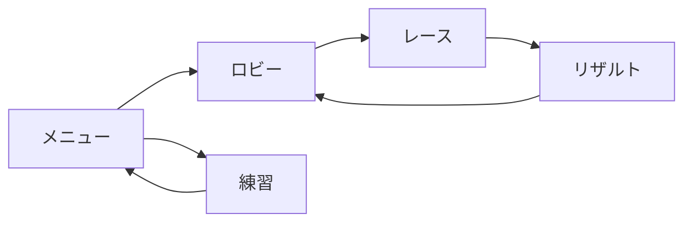

# CatsRace

## 1. ゲーム概要

プレイヤーは猫を操作し、複数のコースでゴールまでのタイムを競います。

最大８人のオンラインマルチプレイ+4体のゴーストと対戦可能です。

## 2. 仕様技術

- ゲーム基盤: [BroccoliEngine](https://github.com/A6P3W/BroccoliEngine)
- オンラインマルチプレイ: Epic Online Services(EOSP2P, EOSLobby, EOSTitleStorage)
- ランキング,ゴースト: GoogleCloud(GCF, Firestore)

## 3. ゲームシステム

### レース

ドリフト継続時間に応じてゲージが蓄積します。ドリフト解除時にはゲージ量に応じたブーストが発生します。

コース上では加速アイテムを取得して任意のタイミングで使用できるほか、減速・加速などのギミックが配置されています。

### オンライン対戦

ロビーを作成または選択して参加し、コースを設定してレースを開始します。

レース中はプレイヤーの位置、向き、ドリフト状態などを同期し、終了後はリザルトを表示してロビーへ戻ります。

### タイムアタック・ランキング

走行をフレームデータとして記録し、クラウドへ保存してゴーストとして再生できます。

クリアタイムはコースごとのワールドランキングへ登録され、上位プレイヤーのゴーストと自分の走行を比較できます。

## 4. ゲームの流れ

## 5. 操作方法

| 操作        | キーボード     | ゲームパッド        |
| --------- | --------- | ------------- |
| アクセル      | `W`       | Right Trigger |
| ブレーキ / 後退 | `S`       | Left Trigger  |
| ステアリング    | `A` / `D` | Left Stick    |
| ドリフト      | `Space`   | South         |
| アイテム使用    | `E`       | West          |
| インタラクト    | `F`       | North         |
| ポーズ       | `Esc`     | Pause         |

